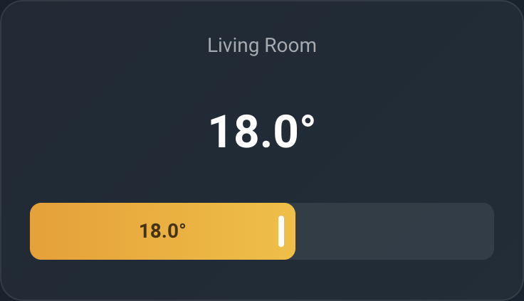

# Thermostat Slider Card

A custom Home Assistant Lovelace card for climate/thermostat control with a visual slider and alert banners.



## Features

- Large current temperature display with heating/cooling accent colors
- Drag or tap slider for setpoint adjustment (debounced service calls)
- Configurable freeze risk and heating-struggling alert banners
- Works with any HA `climate` entity
- Theme-compatible with CSS custom property overrides
- No external dependencies

## Installation

### HACS (recommended)

1. Open HACS in your Home Assistant instance
2. Click the three dots menu (top right) → **Custom repositories**
3. Add the repository URL and select **Integration** as the category
4. Click **Download**, then find **Thermostat Slider Card** in the list
5. Restart Home Assistant

### Manual

Copy the `thermostat_slider_card` folder to `config/custom_components/` and add to `configuration.yaml`:

```yaml
thermostat_slider_card:
```

Restart Home Assistant. The card auto-registers as a Lovelace resource.

## Usage

```yaml
type: custom:thermostat-slider-card
entity: climate.living_room_thermostat
```

### Full configuration

```yaml
type: custom:thermostat-slider-card
entity: climate.living_room_thermostat
name: Living Room              # Optional: override display name
min: 14                        # Optional: slider minimum (default: 14)
max: 21                        # Optional: slider maximum (default: 21)
step: 0.5                      # Optional: slider increment (default: 0.5)
freeze_threshold: 5            # Optional: freeze risk alert below this temp (default: 5)
timer: timer.living_room_heat  # Optional: heating struggling timer entity
threshold: input_number.heat_threshold  # Optional: heating struggling threshold entity
```

### Freeze threshold

The freeze threshold can be a static number or an entity ID for dynamic control:

```yaml
# Static value
freeze_threshold: 5

# OR dynamic — reads value from an input_number entity
freeze_threshold: input_number.freeze_risk_threshold
```

When the current temperature drops below this threshold, a "Freeze risk" alert banner appears on the card.

### Heating struggling alert

When both `timer` and `threshold` are configured:
- If the timer is `idle` AND current temperature is at or below the threshold value, a "Struggling to heat" alert appears.

This is useful for detecting zones where the heating system can't reach the setpoint.

## Theming

The card uses HA theme variables by default and works on both dark and light themes. All colors can be overridden:

| Property | Default | Description |
|----------|---------|-------------|
| `--tsc-card-bg` | `var(--ha-card-background)` | Card background |
| `--tsc-card-border` | `rgba(255,255,255,0.08)` | Card border color |
| `--tsc-card-radius` | `16px` | Card border radius |
| `--tsc-name-color` | `var(--secondary-text-color)` | Zone name color |
| `--tsc-temp-color` | `var(--primary-text-color)` | Temperature text color |
| `--tsc-heating-color` | `#F59E0B` | Temperature color when heating |
| `--tsc-cooling-color` | `#06B6D4` | Temperature color when cooling |
| `--tsc-slider-track` | `rgba(255,255,255,0.08)` | Slider track background |
| `--tsc-slider-fill` | `linear-gradient(90deg, #F59E0B, #FBBF24)` | Slider fill (heating) |
| `--tsc-slider-fill-cool` | `linear-gradient(90deg, #06B6D4, #22D3EE)` | Slider fill (cooling) |
| `--tsc-alert-bg` | `#EF4444` | Alert banner background |
| `--tsc-alert-text` | `#FFF` | Alert banner text color |
| `--tsc-offline-color` | `var(--disabled-text-color)` | Offline text color |
| `--tsc-setpoint-color` | `var(--primary-text-color)` | Setpoint text when outside fill |

Example override via theme:

```yaml
# In your theme file
thermostat-slider-card:
  --tsc-heating-color: "#FF6B35"
  --tsc-slider-fill: "linear-gradient(90deg, #FF6B35, #FF8C42)"
```

Or via card-mod on a specific card:

```yaml
type: custom:thermostat-slider-card
entity: climate.bedroom_thermostat
card_mod:
  style: |
    :host {
      --tsc-heating-color: #FF6B35;
    }
```

## Interactions

- **Tap the card** (outside slider): opens the entity's more-info dialog
- **Drag the slider**: smoothly adjusts setpoint with 500ms debounce
- **Tap the slider** (left/right of thumb): steps setpoint up or down by one increment
